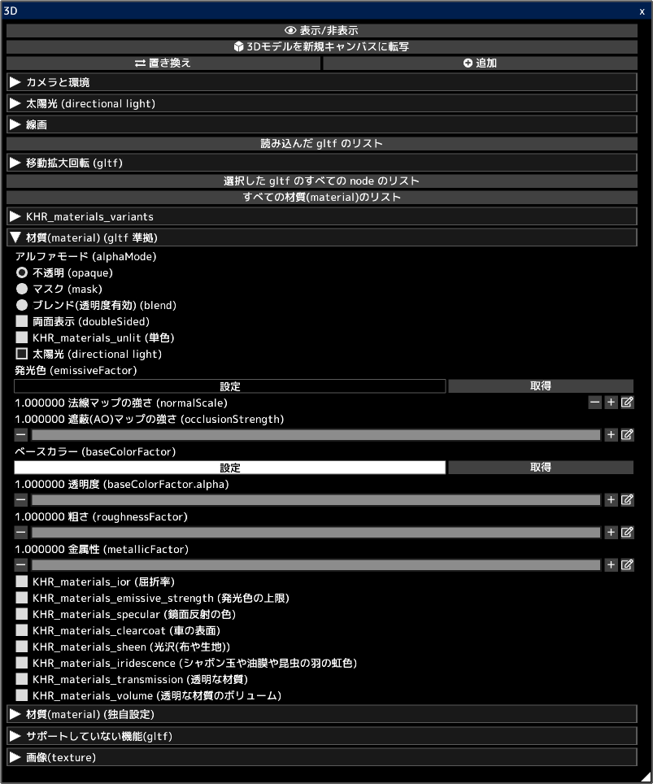

---
hide:
  - toc
---

<!-- https://steamcommunity.com/sharedfiles/filedetails/?id=2963601771 -->

gltf と glb ファイルの 3D モデルを開くことができます。  
3D の見た目をそのまま 2D のキャンバスに転写することができます。  
3D の線画を 2D のキャンバスに転写することもできます。  
そのキャンバスをイラストの作成に利用することができます。例えば、イラストの背景として使うなどです。

3D モデルは [blender](https://www.blender.org/) や Autodesk Maya などの 3D ソフトウェアで作成することができます。  
また、 [sketchfab](https://sketchfab.com/) のようなサイトから 3D モデルをダウンロードすることもできます。

__"置き換え"__ ボタンをクリックすることで、すでに読み込んでいる 3D モデルはすべて削除して新しく読み込む 3D モデルだけにします。  
__"追加"__ ボタンをクリックすることで 、3D モデルを追加します。

__"読み込んだ gltf のリスト"__ をクリックすることで、読み込んだ複数の gltf の中から gltf を1つ選択することができます。  
選択した gltf を移動・回転・拡大縮小させることができます。

__"選択した gltf のすべての node のリスト"__ をクリックすることで、選択した gltf の中にある node (オブジェクト) を選択することができます。  
選択した node を移動・回転・拡大縮小させることができます。

__"すべての材質(material)のリスト"__ をクリックすることで、選択した gltf の中にある material を選択することができます。  
選択した material のパラメータを調節することができます。

__"材質(material) (gltf 準拠)"__ の項目は gltf の仕様に準拠した material のパラメータを列挙しています。  
blender などの 3D ソフトウェアで作成した 3D モデルは、この "材質(material) (gltf 準拠)" の項目にあるパラメータに反映されます。  
[blender での gltf の保存についてはこのサイトを確認してください。](https://docs.blender.org/manual/en/latest/addons/import_export/scene_gltf2.html#gltf-2-0)

[sketchfab](https://sketchfab.com/) のようなサイトからダウンロードした 3D モデルの場合、 sketchfab での見た目と icpaint での見た目が違う場合があります。  
その場合は、 KHR_materials_unlit (単色) を有効にすることで見た目が同じになる可能性があります。

* gltf や glb ファイルを読み込む時はすべての material で "太陽光 (directional light)" が有効になります。読み込んだ後に "太陽光 (directional light)" のチェックボックスをオフにすることができます。
* ポイントライトやスポットライトはサポートしていません (point light, spot light) (KHR_lights_punctual)
* 3D モデルのアニメーションはサポートしていません。
* 発光色 (emissiveFactor) などによるライティングはサポートしていません。
* 3D モデルによる影の作成はサポートしていません。
* KHR_draco_mesh_compression, EXT_meshopt_compression, KHR_mesh_quantization はサポートしていません。
* ktx2 (画像形式) はサポートしていません (KHR_texture_basisu)

[テキストエディタで gltf を編集する方法についてはこのサイトを確認してください。](https://github.com/KhronosGroup/glTF-Tutorials/blob/master/AddingMaterialExtensions/AddingMaterialExtensions_002_UsingVisualStudioCode.md#using-visual-studio-code)

__"材質(material) (gltf 準拠)"__ の項目にあるパラメータの公式の説明は以下の通りです。

* [gltf の仕様](https://registry.khronos.org/glTF/specs/2.0/glTF-2.0.html)
* [アルファモードの説明 (alphaMode)](https://registry.khronos.org/glTF/specs/2.0/glTF-2.0.html#alpha-coverage)
* [両面表示の説明 (doubleSided)](https://registry.khronos.org/glTF/specs/2.0/glTF-2.0.html#double-sided)
* [KHR_materials_unlit (単色)](https://github.com/KhronosGroup/glTF/tree/main/extensions/2.0/Khronos/KHR_materials_unlit#khr_materials_unlit)
* [material の基本的な説明](https://github.com/KhronosGroup/glTF-Tutorials/blob/master/gltfTutorial/gltfTutorial_010_Materials.md#materials)
* [KHR_materials_ior (屈折率)](https://github.com/KhronosGroup/glTF/tree/main/extensions/2.0/Khronos/KHR_materials_ior#khr_materials_ior)
* [KHR_materials_emissive_strength (発光色の上限)](https://github.com/KhronosGroup/glTF/tree/main/extensions/2.0/Khronos/KHR_materials_emissive_strength#khr_materials_emissive_strength)
* [KHR_materials_specular (鏡面反射の色)](https://github.com/KhronosGroup/glTF/tree/main/extensions/2.0/Khronos/KHR_materials_specular#khr_materials_specular)
* [KHR_materials_clearcoat (車の表面)](https://github.com/KhronosGroup/glTF/tree/main/extensions/2.0/Khronos/KHR_materials_clearcoat#khr_materials_clearcoat)
* [KHR_materials_sheen (光沢(布や生地))](https://github.com/KhronosGroup/glTF/tree/main/extensions/2.0/Khronos/KHR_materials_sheen#khr_materials_sheen)
* [KHR_materials_iridescence (シャボン玉や油膜や昆虫の羽の虹色)](https://github.com/KhronosGroup/glTF/tree/main/extensions/2.0/Khronos/KHR_materials_iridescence#khr_materials_iridescence)
* [KHR_materials_transmission (透明な材質)](https://github.com/KhronosGroup/glTF/tree/main/extensions/2.0/Khronos/KHR_materials_transmission#khr_materials_transmission-)
* [KHR_materials_volume (透明な材質のボリューム)](https://github.com/KhronosGroup/glTF/tree/main/extensions/2.0/Khronos/KHR_materials_volume#khr_materials_volume)
