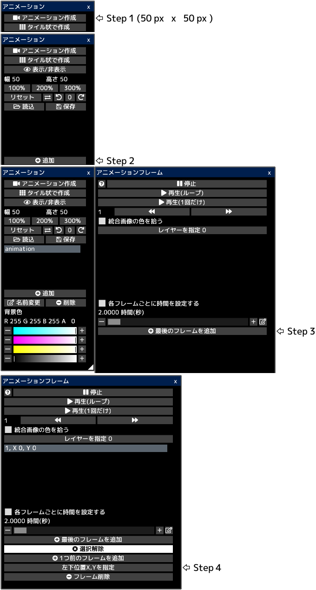

---
hide:
  - toc
---

<!-- https://steamcommunity.com/sharedfiles/filedetails/?id=2962502214 -->

アニメーションはフレームごとに画像を連続して切り替えていくことで動きを表現します。

各フレームはキャンバス内の一部の領域(矩形)です。  
キャンバス内にすべてのフレームが表示されていることになります。

アニメーション gif や webp ファイルを開いた場合、アニメーションがいつでも再生できる状態でキャンバスが作成されます。  
ただし、キャンバスサイズが大きすぎる場合はアニメーションは作成されません。

例えば、このキャンバスの場合、1から13までの数字が書かれている正方形のエリアがアニメーションの各フレームになります。  
アニメーションを再生すると以下のように再生されます。

### アニメーションの作成方法

最初にこのような見た目のキャンバスを作成します。  
次に "キャンバス" メニューから "アニメーションウィンドウ" のボタンをクリックして "アニメーション" ウィンドウを開きます。

フレームを13個作成します。

各フレームの左下の位置を X と Y で指定することができます。  
__"1, X 0, Y 150"__ は1フレーム目の左下の位置が (0, 150) であることを表しています。  
キャンバスの左下の位置が (0, 0) です。  
この例では各フレームの幅と高さは 50 px です。  
フレームを選択している時はキャンバス内に青い矩形の枠が表示されます。

__"統合画像の色を拾う"__ のチェックボックスをオンにした場合は現在のキャンバスの見た目でアニメーションを再生します。  
このチェックボックスをオフにした場合は指定したレイヤーの見た目のみでアニメーションを再生します。

__"再生"__ ボタンをクリックすることでアニメーションが再生されます。  
再生されるアニメーションの位置や大きさはアニメーションのツールを選択することで変更することができます。

gif または webp ファイルでアニメーションを保存することができます。  
gif ファイルは色数に制限があるため、ドット絵レイヤーを選択している場合のみ gif ファイルで保存することができます。  
この場合はドット絵レイヤーの中にアニメーションを描いておく必要があります。
