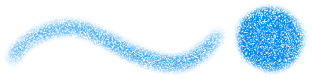

---
hide:
  - toc
---

<!-- https://steamcommunity.com/sharedfiles/filedetails/?id=2965708938 -->

エアブラシ

・ よりソフト  
・ 間隔 0.5  
・ サイズ 50  
・ 不透明度 20%  
・ 最小サイズ 100  
・ 最小不透明度 30%

---

・ ソフト  
・ __間隔 0.1__  
・ サイズ 8  
・ 不透明度 50%  
・ 最小サイズ 0  
・ 最小不透明度 0%

---

・ ハード  
・ __間隔 2.0__  
・ サイズ 14  
・ 不透明度 100%  
・ 最小サイズ 0  
・ 最小不透明度 100%

---

・ __ブラシ円画像 (star.tga)__  
・ 間隔 2.0  
・ サイズ 14  
・ 不透明度 100%  
・ 最小サイズ 0  
・ 最小不透明度 100%

---

・ ハード  
・ 間隔 2.0  
・ サイズ 14  
・ 不透明度 100%  
・ 最小サイズ 0  
・ 最小不透明度 100%  
・ __ブラシベース画像 (tex.tga)__

---

・ __ブラシ円画像 (star.tga)__  
・ 間隔 2.0  
・ サイズ 18  
・ 不透明度 100%  
・ 最小サイズ 0  
・ 最小不透明度 100%  
・ __ブラシベース画像 (tex.tga)__

---

・ __ブラシ円画像 (img.tga)__  
・ 間隔 1.0  
・ サイズ 35  
・ 不透明度 100%  
・ 最小サイズ 40  
・ 最小不透明度 40%  
・ ランダム角度 179°

---

・ よりソフト  
・ 間隔 0.3  
・ サイズ 20  
・ 不透明度 60%  
・ 最小サイズ 70  
・ 最小不透明度 20%  
・ __ブラシベース画像 (tex.tga)__

---

・ よりソフト  
・ 間隔 0.3  
・ サイズ 20  
・ 不透明度 60%  
・ 最小サイズ 70  
・ 最小不透明度 20%  
・ __ブラシベース画像 (circle.png)__  
・ 拡大率 30% (ブラシベース画像)

circle.png

---

・ ハード  
・ 間隔 2.0  
・ サイズ 18  
・ 不透明度 100%  
・ 最小サイズ 0  
・ 最小不透明度 100%  
・ __楕円 40%__  
・ 角度 0°

---

・ ハード  
・ 間隔 2.0  
・ サイズ 18  
・ 不透明度 100%  
・ 最小サイズ 0  
・ 最小不透明度 100%  
・ __楕円 40%__  
・ __角度 130°__

---

ツールウィンドウの一番上のボタンが "__マーカー__" になっている場合は、色を置き換えていくような塗り方になります。

---

ツールウィンドウの一番上のボタンが "__ぼかし(平均色)__" になっている場合は、ブラシ円内の描画内容の平均色で塗ります。  
"__統合画像の色を拾う__" のチェックボックスがオンになっている場合は、キャンバスの現在の見た目をもとに平均色を決定します。  
このチェックボックスがオフになっている場合は、現在のレイヤーの描画内容をもとに平均色を決定します。

---

ツールウィンドウの一番上のボタンが "__色混ぜ__" になっている場合

① 混色 70,  色延び 70, 水分量 10  
② 混色 90,  色延び 70, 水分量 10  
③ 混色 90,  色延び 0, 水分量 10 (1本線で塗る)  
④ 混色 90,  色延び 70, 水分量 10 (1本線で塗る)  
⑤ 混色 90,  色延び 0, 水分量 0  
⑥ 混色 90,  色延び 0, 水分量 70

・ ソフト  
・ 間隔 0.1  
・ サイズ 16  
・ 不透明度 20%  
・ 最小サイズ 50  
・ 最小不透明度 0%
