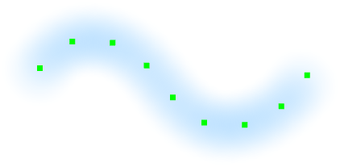

---
hide:
  - toc
---

<!-- https://steamcommunity.com/sharedfiles/filedetails/?id=2971081356 -->

"カーブブラシ" ツールはブラシストロークをあとから修正することができます。  
制御点をクリックして動かすことでブラシストロークを修正することができます。  
ブラシのパラメータも修正することができます。

制御点を左右に Shift + クリックして動かすことで、制御点の位置の筆圧を変えることができます。

|  | 使い方 |
| ------ | ----------- |
| 制御点を移動       | 制御点をクリックしてドラッグ |
| 制御点を鋭角にするかなめらかなカーブにするか | 制御点を Ctrl + クリック |
| カーブの形状を維持したままカーブを移動       | Shift + Alt + クリックしてドラッグ |
| クリックした位置を中心にカーブを回転       | 左右に Ctrl + Shift + Alt + クリックしてドラッグ |

---

・ RGBA (0, 140, 255, 255)  
・ よりソフト  
・ 間隔 20  
・ サイズ 50  
・ 不透明度 10%

---

・ RGBA (0, 140, 255, 255)  
・ ブラシ円画像 (img.tga)  
・ 間隔 30  
・ サイズ 35  
・ 不透明度 100%  
・ ランダム角度 179°

---

・ RGBA (0, 140, 255, 255)  
・ ブラシ円画像 (fur.tga)  
・ 間隔 7  
・ サイズ 30  
・ 不透明度 100%  
・ ブラシストロークに沿って回転

---

・ RGBA (255, 77, 77, 255)  
・ ハード  
・ 間隔 3  
・ サイズ 9  
・ 不透明度 100%

デュアルブラシ

・ RGBA (104, 255, 172, 255)  
・ ソフト  
・ 加算(発光)  
・ 間隔 3  
・ サイズ 8  
・ 不透明度 80%

---

・ RGBA (0, 140, 255, 255)  
・ ブラシ円画像 (splatter.tga)  
・ 間隔 35  
・ サイズ 35  
・ 不透明度 100%  
・ ランダムサイズ 120  
・ ランダム不透明度 50%  
・ ランダム角度 179°

---

・ RGBA (255, 0, 0, 255)  
・ ブラシ円画像 (star.tga)  
・ 間隔 8  
・ サイズ 10  
・ 不透明度 100%  
・ ランダムサイズ 110  
・ ランダム位置 250  
・ ランダム角度 179°

デュアルブラシ

・ RGBA (255, 255, 0, 255)  
・ ブラシ円画像 (star.tga)  
・ 加算(発光)  
・ 間隔 8  
・ サイズ 7  
・ 不透明度 100%  
・ ランダムサイズ 110  
・ ランダム位置 250  
・ ランダム角度 179°
