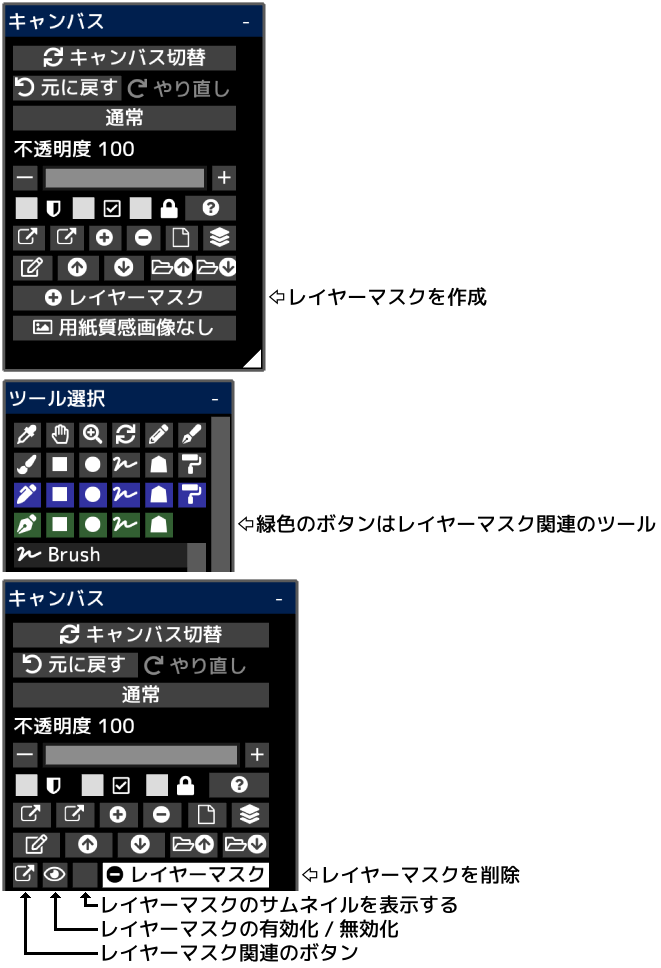

---
hide:
  - toc
---

<!-- https://steamcommunity.com/sharedfiles/filedetails/?id=2953895836 -->

レイヤーマスクを使うことで描画内容を部分的に隠すことができます。  
レイヤーマスクには不透明度があります(0 ~ 255)。  
フォルダに対してレイヤーマスクを作成することもできます。  
調整レイヤーに対してレイヤーマスクを作成した場合は調整レイヤーによる効果を与える部分を調節することができます。
