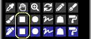

---
hide:
  - toc
---

<!-- https://steamcommunity.com/sharedfiles/filedetails/?id=2967420367 -->

"ツール選択" ウィンドウで ■ のボタンをクリックすることで "矩形" ツールを選択することができます。

RGBA (44,134,245,150) で塗った場合の例

__"角丸"__ のチェックボックスをオンにして 60 % にセットして塗った場合の例

__"枠"__ のチェックボックスをオンにして塗った場合の例

__"縦横比"__ のチェックボックスをオンにした場合は矩形の縦と横の長さの比率を固定させることができます。  
__"px"__ のチェックボックスをオンにした場合は矩形の縦と横の長さを px 単位で指定することができます。

### "円" ツール

RGBA (44,134,245,150) で塗った場合の例

"よりソフト" のラジオボタンを選択して塗った場合の例

__"楕円"__ のチェックボックスをオンにして 40 にセットして塗った場合の例

"よりソフト" のラジオボタンを選択して塗った場合の例

### "投げ縄" ツール

ぼかしなしで塗った場合の例 (RGBA (44,134,245,255))

ぼかし 15x15 px で塗った場合の例 (RGBA (44,134,245,150))

__"可視化モード"__ のチェックボックスをオンにして塗った場合の例 (ぼかし 3x3 px)

### "多角形" ツール

"多角形" ツールはクリックした位置が多角形の頂点になります。  
1つ前まで元に戻すことができます。

---

これらの塗り方はすべて __"合成モード"__ で塗ることもできます。  
例えば、合成モードの "乗算" で塗ることで暗くすることができます。  
また、例えば、合成モードの "加算(発光)" で白っぽい黄色で塗ることで明るくすることができます。
