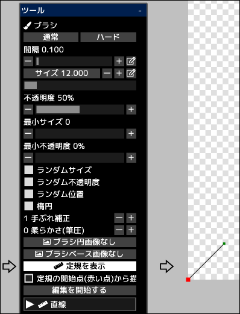

---
hide:
  - toc
---

<!-- https://steamcommunity.com/sharedfiles/filedetails/?id=2969755297 -->

定規に沿ってブラシストロークを描くことができます。

__"定規を表示"__ というボタンをクリックすることでキャンバスの左下の位置に定規が表示されます。  
この定規はベクターレイヤーのカーブと同じ機能を持っています。  
定規の中の赤い点が定規の開始点となります。

__"定規の開始点(赤い点)から描画を開始する"__ のチェックボックスをオフにしている時は、ブラシでタッチした位置と定規との間の最短距離の位置からのブラシストロークになります。

__"編集を開始する"__ というボタンをクリックすることで定規の形状を変更できるようになります。

|  | 使い方 |
| ------ | ----------- |
| 制御点を選択       | 制御点をクリック |
| 制御点を移動       | 制御点をクリックしてドラッグ |
| 制御点を削除       | 制御点を Alt + クリック |
| 制御点を鋭角にするかなめらかなカーブにするか | 制御点を Ctrl + クリック |
| カーブの最後に制御点を追加                   | 制御点以外のどこかをクリック |
| カーブの途中に制御点を追加                   | カーブ上のどこかをクリック |
| カーブの最後に制御点(鋭角)を追加             | 制御点以外のどこかを Ctrl + クリック |
| カーブの途中に制御点(鋭角)を追加             | カーブ上のどこかを Ctrl + クリック |
| カーブの形状を維持したままカーブを移動       | Shift + Alt + クリックしてドラッグ |
| 複数の制御点をまとめて移動 | Shift + クリックしてドラッグで円の内側にある制御点をまとめて移動 |
| カーブを拡大縮小                             | 左右に Ctrl + Alt + クリックしてドラッグ |
| クリックした位置を中心にカーブを回転         | 左右に Ctrl + Shift + Alt + クリックしてドラッグ |

__"編集を終了する"__ というボタンをクリックすることで再びブラシで描画できるようになります。
