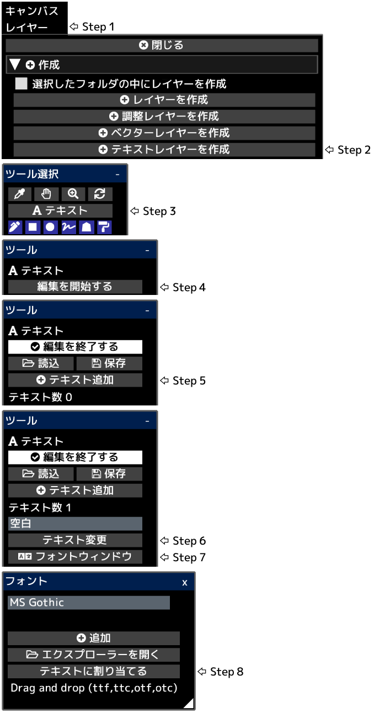

---
hide:
  - toc
---

<!-- https://steamcommunity.com/sharedfiles/filedetails/?id=2954841464 -->

テキストはキャンバスの左下の位置に作成されます。  
__"編集を終了する"__ をクリックした後にレイヤーの不透明度・合成モード・レイヤーマスクなどが適用されます。

「レイヤー」メニューの中の __"レイヤーのラスタライズ"__ ボタンをクリックすることでテキストレイヤーから描画レイヤーに変換することができます。
