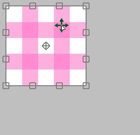
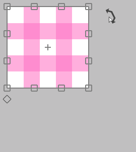
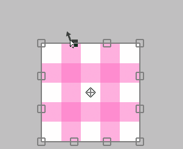
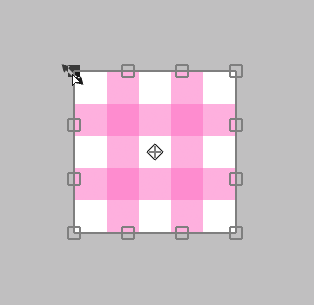

---
hide:
  - toc
---

<!-- https://steamcommunity.com/sharedfiles/filedetails/?id=2955645316 -->

### 変形領域の中にカーソルがある場合

クリックすることで自由に動かすことができます。

Shift + クリックすることで水平方向のみまたは垂直方向のみ動かすことができます。

### 変形領域の外にカーソルがある場合

クリックすることで回転させることができます。

Ctrl + クリックすることでアンカーを中心にして回転させることができます。

### アンカーの上にカーソルがある場合

クリックすることでアンカーのみ動かすことができます。

### 上下左右の辺 ( □ ) の上にカーソルがある場合

クリックすることでその辺を動かすことができます。

Alt + クリックすることで中心を固定して2つの辺を同時に動かすことができます。

Ctrl + クリックすることでその辺を自由に動かすことができます。

Ctrl + Shift + クリックすることで辺の方向に沿ってその辺を動かすことができます。

### 4つの頂点 ( □ ) の上にカーソルがある場合

クリックすることでその頂点を動かすことができます。

Alt + クリックすることで拡大縮小・回転させることができます。

Shift + クリックすることで均一に拡大縮小させることができます。

Shift + Alt + クリックすることで中心を固定して均一に拡大縮小させることができます。

---

Ctrl + クリックすることでその頂点だけを自由に動かすことができます。  
この場合は3つのやり方によって見た目が変わります。

#### 「変形」を実行して Ctrl + クリックの場合

#### 「遠近感ありの変形」を実行して「遠近感」をオフにした時の Ctrl + クリックの場合

#### 「遠近感ありの変形」を実行して「遠近感」をオンにした時の Ctrl + クリックの場合

__"リセット"__ ボタンを押すことで変形前の状態に戻すことができます。

* 変形(キャンバスサイズ)
* 移動拡大回転(キャンバスサイズ)
* 遠近感ありの変形
* ゆがみフィルター
* レタッチフィルター

これら5つのやり方は変形内容を保存することができます。  
もし保存したなら、別のレイヤーに同じ変形を適用させることができます。

数値を指定して変形させる場合は __"移動拡大回転"__ を使ってください。  
例えば 50 % になるように縮小したい場合や 45 度回転させたい場合などです。
