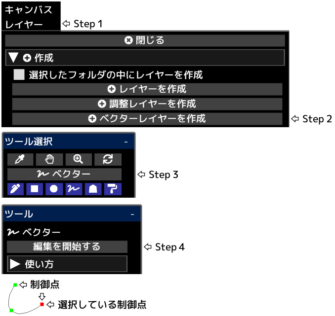

---
hide:
  - toc
---

<!-- https://steamcommunity.com/sharedfiles/filedetails/?id=2955151395 -->

__"編集を終了する"__ をクリックした後にレイヤーの不透明度・合成モード・レイヤーマスクなどが適用されます。

「レイヤー」メニューの中の __"レイヤーのラスタライズ"__ ボタンをクリックすることでベクターレイヤーから描画レイヤーに変換することができます。

|  | 使い方 |
| ------ | ----------- |
| 制御点を選択       | 制御点をクリック |
| 制御点の選択を解除 | 制御点以外のどこかを Alt + クリック |
| 制御点を移動       | 制御点をクリックしてドラッグ |
| 制御点を削除       | 制御点を Alt + クリック |
| 制御点を鋭角にするかなめらかなカーブにするか | 制御点を Ctrl + クリック |
| カーブの最後に制御点を追加         | 制御点を選択した状態で制御点以外のどこかをクリック |
| カーブの途中に制御点を追加         | 制御点を選択した状態でカーブ上のどこかをクリック |
| カーブの最後に制御点(鋭角)を追加   | 制御点を選択した状態で制御点以外のどこかを Ctrl + クリック |
| カーブの途中に制御点(鋭角)を追加   | 制御点を選択した状態でカーブ上のどこかを Ctrl + クリック |
| 別のカーブとして制御点を作成       | 制御点を選択していない状態で制御点以外のどこかをクリック |
| 別のカーブとして制御点(鋭角)を作成 | 制御点を選択していない状態で制御点以外のどこかを Ctrl + クリック |
| カーブを削除 | すべての制御点で Alt + クリックを繰り返す、または「カーブの削除」ボタンをクリック |
| カーブの形状を維持したままカーブを移動 | 制御点を選択した状態で Shift + Alt + クリックしてドラッグ |
| カーブを複製                           | 制御点を選択した状態で Ctrl + Shift + クリックしてドラッグ |
| 複数の制御点をまとめて移動           | Shift + クリックしてドラッグで円の内側にある制御点をまとめて移動 |
| カーブを拡大縮小                     | 左右に Ctrl + Alt + クリックしてドラッグ |
| クリックした位置を中心にカーブを回転 | 左右に Ctrl + Shift + Alt + クリックしてドラッグ |
